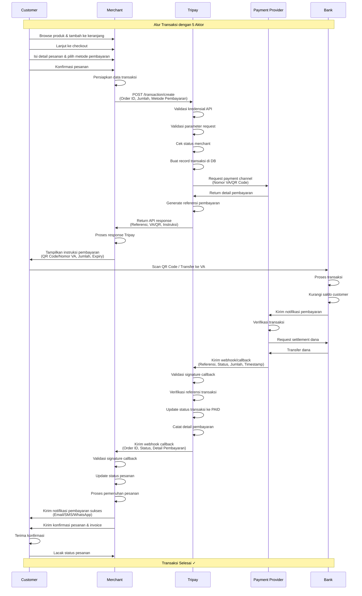

Sistem TriPay didesain untuk memproses transaksi pembayaran dengan aman dan stabil bagi end-users melalui API dan berinteraksi dengan web app Laravel + Vue melalui setup server yang terpisah, sesuai dengan penggunaannya.

## Rincian Komponen

1. **End-User**: Pengguna akhir berinteraksi dengan website Tripay untuk melakukan pendaftaran, konfigurasi merchant, dan melihat detail transaksi.

2. **Merchant Server**: Server merchant yang melakukan integrasi API Tripay untuk memproses transaksi.

3. **Lapisan Cloudflare**: Semua traffic masuk dan keluar dialihkan melalui Cloudflare untuk menyediakan perlindungan DDoS, aturan pemfilteran IP, dan caching resource.

4. **Server Kolokasi Maxcloud**:
   - **Webhook Service**: Mengirim notifikasi asinkron (callback) dari Tripay ke server merchant terkait pembaruan status transaksi.
   - **Web App**: Aplikasi monolith Laravel yang menangani layanan frontend (Vue.js) dan backend, termasuk user interface, pemrosesan logika bisnis, dan API endpoint untuk integrasi merchant.
   - **Database**: Sistem database relasional untuk menyimpan data pengguna, catatan transaksi, pengaturan, dan log.

5. **Penyedia Layanan Pembayaran**: Sistem terhubung ke beberapa penyedia layanan pembayaran dan agregator (misalnya, Bank BCA, BNI, Neo, NOBU, Prismalink, DurianPay, LinkQu, Esmartlink, PakaiLink) untuk memproses berbagai macam pembayaran bank/QRIS.

6. **Bank**: Tujuan akhir dari dana settlement; perpindahan uang yang sebenarnya terjadi di sini melalui integrasi penyedia layanan pembayaran.

7. **Integrasi & Tools Pihak Ketiga**:
   - **Email dan Storage**: Amazon SES untuk pengiriman email transaksional dan S3 untuk menyimpan file dan data pengguna.
   - **Analytics**: Google Analytics, Microsoft Clarity, dan PostHog untuk pelacakan aktivitas pengguna, analitik produk, dan heatmap.
   - **Layanan Pihak Ketiga**: Verihubs dan Gemini untuk verifikasi identitas/KYC, WhatsApp API untuk notifikasi pelanggan.
   - **Tools Lainnya**: n8n untuk otomatisasi workflow, Metabase untuk analitik data/dashboard, OpnForm untuk manajemen form dan use case internal.

## Alur Data dan Proses

### Diagram Aktivitas Transaksi

### Alur Transaksi Lengkap

**1. Customer Memulai Pembelian (Customer → Merchant)**
   1. Customer menjelajahi produk/layanan di website merchant
   2. Customer menambahkan item ke keranjang dan melanjutkan ke checkout
   3. Customer mengisi detail pesanan (info pengiriman, kontak, dll.)
   4. Customer memilih metode pembayaran dan mengkonfirmasi pesanan
   5. Server merchant menerima data pesanan dan mempersiapkan transaksi

**2. Inisiasi Transaksi (Merchant → Tripay)**
   1. Server merchant mengirim request API ke Tripay dengan detail transaksi:
      - Order ID, jumlah, info customer, metode pembayaran yang dipilih
   2. Request melewati layer Cloudflare
   3. Tripay Web App menerima dan memvalidasi request:
      - Validasi kredensial API (Merchant Code, API Key, Signature)
      - Validasi parameter request
      - Cek status merchant dan saldo
   4. Tripay membuat record transaksi di Database
   5. Tripay generate instruksi pembayaran/nomor referensi
   6. Tripay mengembalikan response API ke merchant dengan:
      - Referensi transaksi
      - Instruksi pembayaran
      - QR code (untuk QRIS)
      - Nomor virtual account (untuk transfer bank)
      - Payment URL/redirect link

**3. Tampilan Pembayaran (Merchant → Customer)**
   1. Server merchant menerima response dari Tripay
   2. Merchant menampilkan instruksi pembayaran ke customer:
      - Menampilkan detail metode pembayaran
      - Menampilkan QR code atau nomor VA
      - Menampilkan jumlah pembayaran dan waktu kadaluarsa
   3. Customer melihat instruksi pembayaran

**4. Proses Pembayaran (Customer → Payment Provider → Bank)**
   1. Customer menyelesaikan pembayaran:
      - Scan QR code dengan aplikasi banking, ATAU
      - Transfer ke nomor virtual account, ATAU
      - Menggunakan e-wallet/metode pembayaran lainnya
   2. Bank customer memproses transaksi
   3. Payment Provider menerima notifikasi pembayaran dari bank
   4. Payment Provider memverifikasi dan memproses transaksi
   5. Dana ditransfer ke rekening bank yang dituju

**5. Notifikasi Pembayaran (Bank → Payment Provider → Tripay)**
   1. Bank mengirim konfirmasi pembayaran ke Payment Provider
   2. Payment Provider mengirim webhook/callback ke Tripay:
      - Referensi transaksi
      - Status pembayaran (success/failed)
      - Jumlah pembayaran
      - Timestamp pembayaran
   3. Tripay menerima dan memvalidasi callback:
      - Validasi sumber/signature callback
      - Cek referensi transaksi
   4. Tripay update status transaksi di Database
   5. Tripay mencatat detail pembayaran dan timestamp

**6. Notifikasi Merchant (Tripay → Merchant)**
   1. Tripay Webhook Service mengirim callback ke callback URL merchant:
      - Referensi transaksi
      - Order ID
      - Status pembayaran
      - Detail pembayaran
   2. Server merchant menerima notifikasi callback
   3. Merchant memvalidasi signature callback
   4. Merchant update status pesanan di sistem mereka
   5. Merchant mengirim konfirmasi pesanan ke customer (email/SMS/WhatsApp)
   6. Merchant memproses pemenuhan pesanan:
      - Generate invoice
      - Persiapan pengiriman
      - Aktivasi produk/layanan digital

**7. Konfirmasi Customer (Merchant → Customer)**
   1. Customer menerima notifikasi pembayaran sukses
   2. Customer menerima konfirmasi pesanan
   3. Customer dapat melacak status pesanan
   4. Transaksi selesai

### Proses Tambahan

**Pelaporan & Analitik**:
- Semua aktivitas transaksi dicatat ke Database
- Log aktivitas dikirim ke tools Analytics (Google Analytics, Clarity, PostHog)
- Data transaksi tersedia di Metabase untuk reporting
- Merchant dapat melihat laporan transaksi di dashboard Tripay

**Penanganan Transaksi Gagal**:
- Jika pembayaran gagal atau kadaluarsa, status diupdate sesuai
- Notifikasi webhook dikirim ke merchant dengan status gagal
- Customer diberitahu tentang kegagalan pembayaran
- Customer dapat mencoba ulang pembayaran atau membatalkan pesanan
